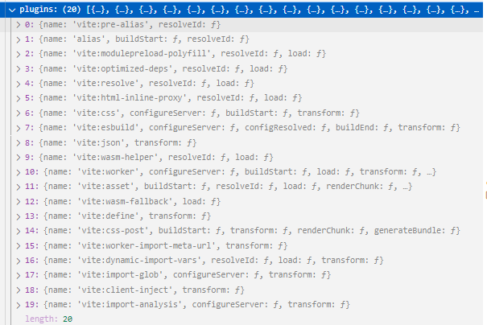

# Vite是什么

# Vite依赖的构建工具

## Esbuild 

`Esbuild` 是一款 `JavaScript` 打包工具。 强调性能，编译速度特别快，因为它是基于 `Go` 语言开发（编译运行），且架构设计优秀。缺点是目前生态不如`webpack`和`rollup`成熟，例如 `esbuild`对于`css`和代码分割不是很友好。

## Rollup

强调对库开发的支持，基于`ESM`系统，对`Tree Shaking`有着良好的支持，产物非常干净，支持多种输出格式，适合做库的开发，插件`API`比较友好，缺点是做应用开发时需要依赖各种插件且效果不佳，例如对`CJS`支持需要引入插件并且需要各种`Hack`。

# 实现原理

## 依赖预编译

依赖即在开发时不会变动的纯 JavaScript。在启动服务之前，扫描入口文件（比如 `index.html`）中依赖的模块后，形成依赖路径数据结构，利用`Esbuild`预构建。依赖请求会以 HTTP 头 `max-age=31536000,immutable` 强缓存，以提高在开发时的页面重载性能。

## 原生`ESM`方式提供源码

通常包含一些并非直接是 JavaScript 的文件，需要转换（例如 `JSX`，`CSS `或者 `Vue` 组件），时常会被编辑。Vite 只需要在浏览器请求源码时进行转换并按需提供源码，同时利用 HTTP 头来加速整个页面的重新加载（再次让浏览器为我们做更多事情）：源码模块的请求会根据 `304 Not Modified` 进行协商缓存，这实际上是让浏览器接管了打包程序的部分工作。

## 调用 `Rollup`

在开发中，`Vite` 开发服务器会创建一个插件容器来调用 `Rollup` 构建钩子，但是并不是与所有的 `Rollup` 钩子相同，不仅`Vite`有很多独有的钩子，而且并不是所有的`Rollup`钩子都会调用，例如Vite 为了在开发模式的性能会避免完整的 `AST` 解析（ [`moduleParsed`](https://rollupjs.org/guide/en/#moduleparsed)钩子不会调用）。

`Vite`本身也内置了很多插件，以下是零配置启动一个原生`JS`项目时，可以看到的内置插件：

# 对比

## 下载量

## 与`Webpack `对比

- **打包编译实现方式不同。**`Webpack`是基于`Node.js`实现打包的，`Vite`是基于`Go`编写的`ESBuild`实现预编译依赖。
- **打包过程不同。**`Webpack`大概分为以下几个步骤：识别入口文件，对整个应用递归识别依赖、构建构建以来图谱将代码转化成抽象语法树（`AST`）处理代码，将`AST`转换回浏览器可以识别的代码输出。`Vite`会对依赖做预编译并利用浏览器的强缓存机制，实时处理的代码只有当前屏幕用到的。
- **应用体积增加的影响。**因为构建方式原理决定，更新代码就需要重建整个包（哪怕是`HMR`）`Webpack`会随着随着体积增加而变慢，而`Vite`不会。
- **生态。**`Webpack`生态强大，插件系统强大，对各种模块系统兼容性很好（`AMD`、`CJS`、`UMD`、`ESM`）。`Vite`还在发展中
- **对库`Vue`及`TypeScript`的支持。**`Vite`对`Vue`是第一优先级支持，对`TypeScript`也是天然支持。`Webpack`需要引入`Loader`。
- **学习曲线。**`Webpack`的配置繁重、`API`复杂，学习曲线陡峭；`Vite`干净轻便，使用容易上手。