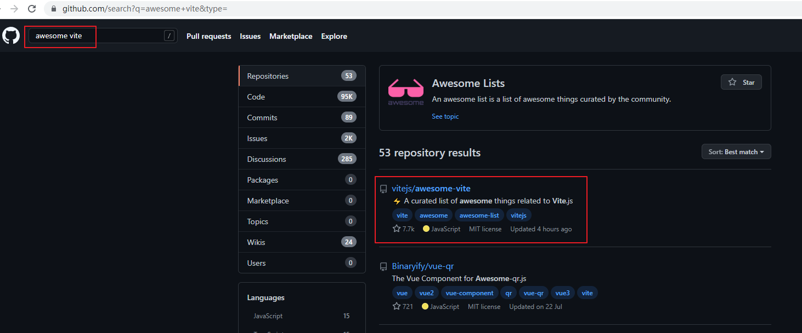
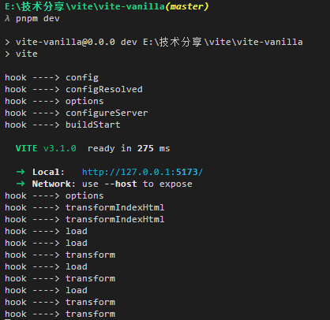
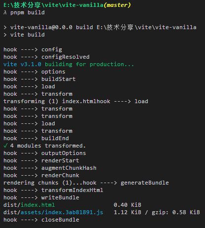

# Vite插件

插件可以理解为一种遵循某种规范，实现某种功能的程序。Vite插件就是赋予Vite更强大的功能，与Webpack不同的是，Webpack有区分Loader和Plugin，而在Vite中Loader也是作为Plugin去实现，这也是源于Vite是借助Rollup实现编译。

之前讲过，在生产环境下，Vite是通过Rollup来打包源代码。但是在开发环境下，Vite只会**模拟**Rollup的行为，之所以在开发环境没有直接调用`Rollup`的API是为了让性能得到更大的提升，但同时在保证同一套配置文件表现一致的前提下，能够像 Rollup 一样，能够解析插件对象，并对插件的钩子进行正确的执行和处理。

开发插件最主要的就是要了解**钩子**，以及它们**调用的时机**。Vite支持Rollup的大部分钩子，再基于一些优化的考虑，增加了一些自身特有的钩子，并且已经预设了多个Rollup插件。


## Vite插件的使用

插件的使用非常简单，只需要三步：
1. 找到具备所需功能的Vite插件。在找相关技术栈的周边工具的时候，我一般是在github上搜索`awesome xxx`。
   

2. 下载。添加到项目的 devDependencies。
   ```bash
    npm i vite-plugin-banner -D 
   ```
3. 在 vite.config.js 配置文件中的 plugins 数组中引入它，可以根据该插件的API来配置相关参数。

    ```js
    // vite.config.js

    import { defineConfig } from "vite";
    import banner from 'vite-plugin-banner';

    export default defineConfig({
        plugins: [banner('This is the banner content.')]
    })

    ```


## 实现一个插件

### 需求分析
目标：想要直观的看线上代码是哪个版本
方案：

- 时间戳。
- 版本号。结合ONES的版本规划、Git的`tag`或者`release`
- Git的分支管理。
- Git的`commit hash`

表现形式：
- 通过控制台打印
- 通过最终输出文件名表现
- 文件注释

这里我们选择，Git的`commit hash`结合控制台打印的方案（当然并不是这样就不需要Git的版本管理）。

### 实现需求

Vite插件的结构非常简单，就是一个对象，这个对象有一些必填属性（name）和选填属性（钩子函数），例如：

```js
// vite.config.js

import { defineConfig } from "vite";

export default defineConfig({
  plugins: [
    {
        name: "my-plugin", // 命名要遵循约定
        transform(code, id) { // 钩子函数
            return code + "var a = 1; console.log(a)"
        }
    },
  ],
});
```
实现需求：

```js
// vite.config.js

import { defineConfig } from "vite";
import { execSync } from "child_process";

export default defineConfig({
  plugins: [
    {
      name: "my-plugin",
      apply: "build",
      transformIndexHtml(html) {
        const hash = runGit("git rev-parse HEAD");
        const branch = runGit("git rev-parse --abbrev-ref HEAD");
        const date = runGit("git log -1 --format=%ci");

        function runGit(str) {
          return execSync(str).toString().replace("\n", "");
        }
        
        return [
          {
            tag: "script",
            children: `
                console.info("branch: ${branch}")
                console.info("hash: ${hash}")
                console.info("date: ${date}")
            `,
            injectTo: "head",
          },
        ];
      },
    },
  ],
});
```


## 封装发布

前面的插件内容都是直接写在了`vite.config.js`中，当插件多的时候或者想要向社区贡献插件的时候显然这是很不方便维护的。接下来将以最简洁的形式将插件发布到Coding私有镜像库：

1. 新创建一个项目，命名为`vite-plugin-git-log`

   > - 插件使用Vite 特有的钩子，则以`vite-plugin-xxx`的格式命名，如果用于特定的框架（例如`Vue`）则以`vite-plugin-vue-xxx`的格式命名。
   >
   > - 插件是可以兼容Rollup的，则以`rollup-plugin-xxx`的格式命名

2. 添加`package.json`:
   ```json
   {
    "name": "vite-git-log",
    "version": "1.0.0",
    "description": "",
    "main": "index.js",
    "scripts": {
        "test": "echo \"Error: no test specified\" && exit 1"
    },
    "peerDependencies": {
        "vite": "^3.1.0"
    },
    "engines": {
        "node": "^14.18.0 || >=16.0.0"
    },
    "author": "xxx",
    "license": "MIT"
    }
   ```

3. 新建`index.js`:
   ```js
   import { execSync } from "child_process";
   
    export default function (pluginOptions) {
        const hash = runGit("git rev-parse HEAD");
        const branch = runGit("git rev-parse --abbrev-ref HEAD");
        const date = runGit("git log -1 --format=%ci");
   
        function runGit(str) {
            return execSync(str).toString().replace("\n", "");
        }
   
        return {
            name: "vite-plugin-git-log",
            apply: "build",
            transformIndexHtml(html) {
            return [
                {
                tag: "script",
                children: `
                        console.info("branch: ${branch}")
                        console.info("hash: ${hash}")
                        console.info("date: ${date}")
                    `,
                injectTo: "head",
                },
            ];
            },
        };
    }
   ```

4. 找管理员开通推送权限。然后根据[操作指引](https://sutpc.coding.net/p/kczx_public_repo/artifacts/13441735/npm/packages?hash=4016225f09534d11a17c1f419244b2ec)配置好了，就可以推送了。

5. 在项目中就可以通过`npm install vite-plugin-git-log -D`之类的命令安装使用了。


## 插件钩子

上面的内容主要是先写一个插件体验下，没有讲Vite插件的API，例如上面写过的两个插件，为什么配置的钩子函数不同，不同的钩子又有什么不同？

对于插件开发者来说，最重要的就是要知道选择哪个（些）钩子，并在对应的钩子里实现不同的业务，进而达成目的。下面就将钩子做一个总结：

### 调用时机

- **Build Hooks**
  const chunks = rollup.rollup() 执行期间的构建钩子函数 

- **Output Generation Hooks**
  chunks.generator(write)执行期间的输出钩子函数

- **WatchChange Hooks**

  rollup.watch() 执行期间监听文件变化并重新执行构建的钩子函数

### 调用形式
- **async**: 该钩子还可能返回一个解析为相同类型值的 `Promise`；否则，钩子被标记为`​​sync​`​。  
- **first**:  如果多个插件实现了相同的钩子函数，那么会串式执行，从头到尾，但是，如果其中某个的返回值不是 null 也不是 undefined 的话，会直接终止掉后续插件。
- **sequential**:  如果多个插件实现了相同的钩子函数，那么会串式执行，按照使用插件的顺序从头到尾执行，如果是异步的，会等待之前处理完毕，在执行下一个插件。
- **parallel**:  同上，不过如果某个插件是异步的，其后的插件不会等待，而是并行执行，这个也就是我们在 `rollup.rollup()` 阶段看到的处理方式。

## 插件常见钩子及顺序

先来实际运行看一下执行效果：

`pnpm dev`:



`pnpm build`:



开发的钩子


| 钩子 | 类型 | 描述 | 是否Vite独享 |
| ---- | ---- | ------------ | ---- |
| config | async`, `sequential | 在解析 Vite 配置前调用。可以返回一个将被深度合并到现有配置中的部分配置对象，或者直接改变配置（如果默认的合并不能达到预期的结果） | 是 |
| configResolved | async`, `parallel | 在解析 Vite 配置后调用。使用这个钩子读取和存储最终解析的配置。当插件需要根据运行的命令做一些不同的事情时，它也很有用。 | 是 |
| options | async, sequential | 替换或操作传递给 rollup.rollup 的选项对象 | 否 |
| configureServer | async`, `sequential | 是用于配置开发服务器的钩子。最常见的用例是在内部 [connect](https://github.com/senchalabs/connect) 应用程序中添加自定义中间件 | 是 |
| buildStart | async, parallel | 在每个 rollup.rollup 构建中调用。当您需要访问传递给 rollup.rollup() 的选项时。 | 否 |
| transformIndexHtml | async`, `sequential | 转换 `index.html` 的专用钩子。 | 是 |
| resolveId | async, first | 定义自定义解析器。解析器可用于例如定位第三方依赖。 | 否 |
| load | async, first | 定义一个自定义加载器。 | 否 |
| transform | async, sequential | 可用于转换单个模块。 | 否 |
| buildEnd | async, parallel | 服务器关闭时被调用。在 rollup 完成捆绑，但在调用 generate 或 write 之前调用 | 否 |


构建输出的钩子

| 钩子               | 类型                | 描述                                                         |
| ------------------ | ------------------- | ------------------------------------------------------------ |
| outputOptions      | sync, sequential    | 替换或操作传递给 bundle.generate() 或 bundle.write() 的输出选项对象。 |
| renderStart        | async, parallel     | 每次调用 bundle.generate() 或 bundle.write() 时最初调用。    |
| augmentChunkHash   | sync, sequential    | 用于增加单个chunk的hash。                                    |
| renderChunk        | async, sequential   | 用于转换单个chunk。                                          |
| generateBundle     | async, sequential   | 在 bundle.generate() 结束时或在将文件写入 bundle.write() 之前立即调用。 |
| transformIndexHtml | async`, `sequential | 转换 `index.html` 的专用钩子。                               |
| writeBundle        | async, parallel     | 写入所有文件后，仅在 bundle.write() 末尾调用。               |
| closeBundle        | async, parallel     | 整个构建输出完成时调用                                       |


## 插件顺序

一个 Vite 插件可以额外指定一个 `enforce` 属性（类似于 webpack 加载器）来调整它的应用顺序。`enforce` 的值可以是`pre` 或 `post`。解析后的插件将按照以下顺序排列：

- Alias
- 带有 `enforce: 'pre'` 的用户插件
- Vite 核心插件
- 没有 enforce 值的用户插件
- Vite 构建用的插件
- 带有 `enforce: 'post'` 的用户插件
- Vite 后置构建插件（最小化，manifest，报告）
