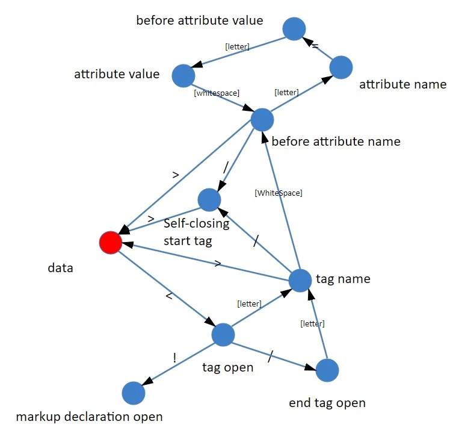

HTML 的词汇和语法在 W3C 组织创建的规范中进行了定义。因为HTML的语法不是与上下文无关的（也就不能通过BNF的格式定义），所以常规解析器也不适用于解析HTML。导致HTML语法的特殊性主要原因在于：
> - 语言的宽容本质。
> - 浏览器历来对一些常见的无效 HTML 用法采取包容态度。
> - 解析过程需要不断地反复。源内容在解析过程中通常不会改变，但是在 HTML 中，脚本标记如果包含 document.write，就会添加额外的标记，这样解析过程实际上就更改了输入内容。  

HTML的解析算法由两个阶段组成：__标记化__ 和 __树构建__。如下图：  

标记化是词法分析过程，将输入内容解析成多个标记。HTML 标记包括起始标记、结束标记、属性名称和属性值。标记生成器识别标记，传递给树构造器，然后接受下一个字符以识别下一个标记；如此反复直到输入的结束。

## 标记化算法
该算法使用状态机来表示。每一个状态接收来自输入信息流的一个或多个字符，并根据这些字符更新下一个状态。当前的标记化状态和树结构状态会影响进入下一状态的决定。这意味着，即使接收的字符相同，对于下一个正确的状态也会产生不同的结果，具体取决于当前的状态。
### 状态机
大部分语言的词法部分都是通过状态机实现的。以下是部分词（token）的解析：  

  

## 树构建算法
标记生成器识别标记，传递给树构造器，然后接受下一个字符以识别下一个标记；如此反复直到输入的结束。在创建解析器的同时，也会创建 Document 对象。在树构建阶段，以 Document 为根节点的 DOM 树也会不断进行修改，向其中添加各种元素。标记生成器发送的每个节点都会由树构建器进行处理。规范中定义了每个标记所对应的 DOM 元素，这些元素会在接收到相应的标记时创建。这些元素不仅会添加到 DOM 树中，还会添加到开放元素的堆栈中。此堆栈用于纠正嵌套错误和处理未关闭的标记。其算法也可以用状态机来描述。这些状态称为“插入模式”。

# 源地址
- [浏览器的工作原理：新式网络浏览器幕后揭秘](https://www.html5rocks.com/zh/tutorials/internals/howbrowserswork/#The_browsers_we_will_talk_about) 
- winter神在极客时间的“重学前端”课程  