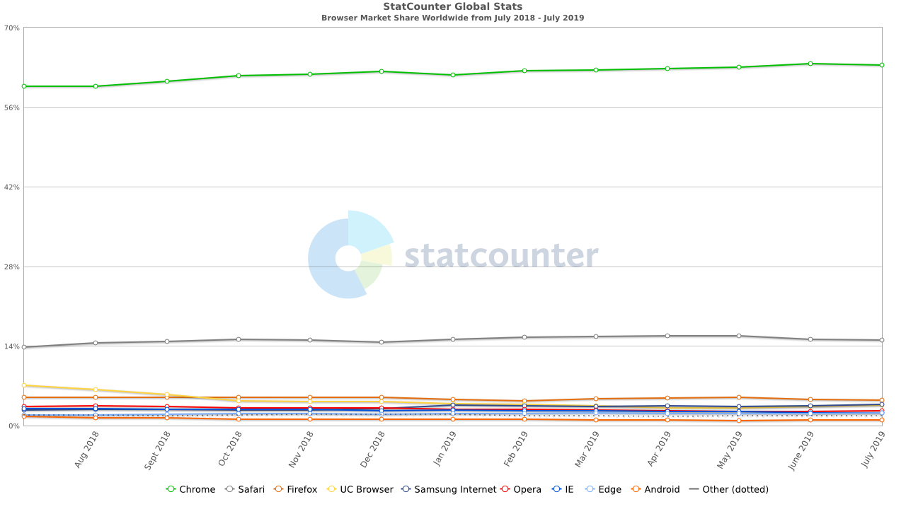

# 市场份额
目前主流浏览器市场份额：

<!--  -->

# 浏览器的高层结构
> - __用户界面__ - 包括地址栏、前进/后退按钮、书签菜单等。除了浏览器主窗口显示的您请求的页面外，其他显示的各个部分都属于用户界面。  
> - __浏览器引擎__ - 在用户界面和呈现引擎之间传送指令。  
> - __呈现引擎__ - 负责显示请求的内容。如果请求的内容是 HTML，它就负责解析 HTML 和 CSS 内容，并将解析后的内容显示在屏幕上。  
> - __网络__ - 用于网络调用，比如 HTTP 请求。其接口与平台无关，并为所有平台提供底层实现。  
> - __用户界面后端__ - 用于绘制基本的窗口小部件，比如组合框和窗口。其公开了与平台无关的通用接口，而在底层使用操作系统的用户界面方法。  
> - __JavaScript 解释器__。用于解析和执行 JavaScript 代码。  
> - __数据存储__。这是持久层。浏览器需要在硬盘上保存各种数据，例如 Cookie。新的 HTML 规范 (HTML5) 定义了“网络数据库”，这是一个完整（但是轻便）的浏览器内数据库。  

# 呈现引擎
基于上面的市场份额，我们就只看看WebKit呈现引擎的呈现主流程:


## 解析
解析的过程可以分成两个子过程：词法分析和语法分析。
- __词法分析器__（有时也称为标记生成器）根据 *词汇* 进行 *词法分析*，将文档分解成一个个有效的标记。
- __解析器__ 根据 *语法* 规则进行 *语法分析*，进而构建解析树（语法树）。

解析是一个迭代的过程。通常，解析器会向词法分析器请求一个新标记，并尝试将其与某条语法规则进行匹配。如果发现了匹配规则，解析器会将一个对应于该标记的节点添加到解析树中，然后继续请求下一个标记。

如果没有规则可以匹配，解析器就会将标记存储到内部，并继续请求标记，直至找到可与所有内部存储的标记匹配的规则。如果找不到任何匹配规则，解析器就会引发一个异常。这意味着文档无效，包含语法错误。

__示例：__ 解析 `2 + 3 - 1 `这个表达式，会返回下面的树  


### 词汇
通常使用正则表达式表示：
```
INTEGER :0|[1-9][0-9]*
PLUS : +
MINUS: -
```

### 语法
语法通常使用一种称为 BNF 的格式来定义。
```
expression :=  term  operation  term
operation :=  PLUS | MINUS
term := INTEGER | expression
```
## 翻译
很多时候，解析树还不是最终产品。解析通常是在翻译过程中使用的，而翻译是指将输入文档转换成另一种格式。编译就是这样一个例子。编译器可将源代码编译成机器代码，具体过程是首先将源代码解析成解析树，然后将解析树翻译成机器代码文档。


# 说明
这只是读 [浏览器的工作原理：新式网络浏览器幕后揭秘](https://www.html5rocks.com/zh/tutorials/internals/howbrowserswork/#The_browsers_we_will_talk_about) 的笔记