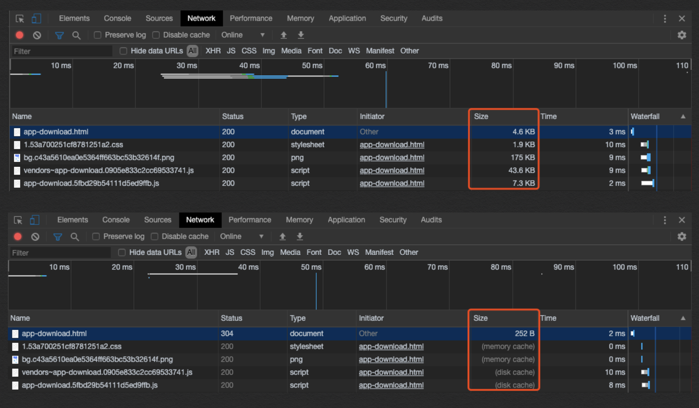

# 主要步骤
概括浏览器处理一个请求会经历下面这些阶段：
1. 重定向
2. 拉取缓存
3. DNS查询
4. 建立TCP连接
5. 发起请求
6. 接收响应
7. 处理HTML元素
8. 元素加载完成  

下面是navigation timing监测指标图：

# 单步分解
## 重定向
先来看一下连续两次请求一个网页的资源的效果：

通过上图可以看出第一次访问是直接从服务器下载资源，但是第二次是走缓存了，分为内存缓存（memory cache）和磁盘缓存（disk cache）。在第一次请求资源的时候，默认会将该资源保存在内存中，如果响应头中带有tag字段，则保存到磁盘中。

## 域名解析
1. 搜索浏览器的DNS缓存，如果命中则解析完成。Chrome可以通过在地址栏输入`chrome://net-internals/#dns`查看。
2. 搜索操作系统DNS缓存，如果命中则解析完成。Mac命令行输入`scutil --dns`，Windows通过命令行输入`ipconfig /displaydns`。
3. 读取`hosts`文件，如果在该文件中有该域名与IP的映射配置，则解析完成。MAC通过`sudo vi /etc/hosts`，Windows在`C:\Windows\System32\drivers\etc`目录下。
4. 向本地配置的DNS服务器（一般是电信运营商提供的）发起递归域名解析请求，直到电信运营商的DNS服务器提供给我们该域名的IP地址。运营商的DNS服务器解析：
   1. 查找自身的缓存，找到对应的条目，且没有过期，则返回IP。
   2. 向根域名服务器发请求，拿到下一级的DNS服务器地址（例如 com域的IP地址）。运营商DNS服务器内置13台根域名DNS的IP地址。
   3. 向上一步拿到的DNS服务器地址发请求，拿到下一级的DNS服务器地址（例如 xxx.com域的IP地址，一般是由域名注册商提供的，像万网，新网等)
   4. 继续向上一步拿到的DNS服务器地址发请求，拿到DNS服务器地址（例如 www.xxx.com 域的IP地址）
   5. ...
   6. 返回IP地址给操作系统
5. 系统将IP地址返回给浏览器。